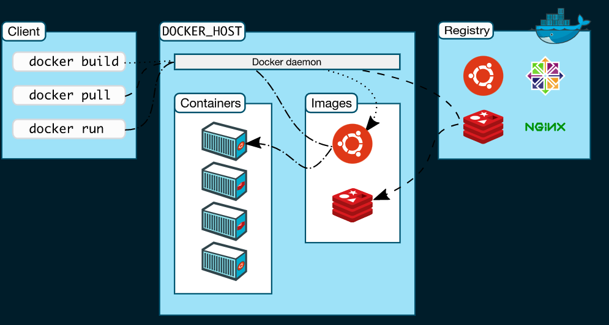

# Docker란?



간단하게 말해서 컨테이너라는 격리된 환경을 만들고,
그 환경내에서 어플리케이션을 패키징하고 실행할 수 있는 기능을 제공하는 툴입니다.

더 자세한 설명은 다른 블로그나, 공식 문서에 잘 설명되어있기때문에 생략하도록 하고, 저는 Docker를 공부하면서 알게된 내용을 정리하도록 하겠습니다.

## Docker를 왜 사용하나요?

나는 특정한 툴이나,라이브러리,프레임워크를 이유없이 쓰지않습니다.공부하면서 내가 공부하고있는 것이 납득이 되지 않으면 의욕이 생기지 않아서, 노가다를 할지언정 사용하지 않습니다.

이렇게하면 왜 쓰는지 자연스럽게 알게됩니다. 설령 내가 해당 툴을 100% 활용하지 못하더라도 내가 필요함을 느끼고 공부하게된거라면 충분하다고 생각합니다.

## 그래서 왜 사용했나요?

팀프로젝트나, 외주 업무를 담당할때 nodeJS 서버를 구축하고 배포할 일이 3번정도 있었습니다. AWS EC2와 naver cloud flatform을 사용했었는데, ubuntu만 설치한다음 node를 설치하고 github를 통해 소스를 업데이트하면서 클라우드 환경을 구축했습니다. db도 cloude 내에 설치하여 local환경으로 연결해놓았구요.

이 작업의 텀이 길다보니 오랜만에 클라우드 환경에서 다시 우분투를 설치하고 node를 설치하는 과정에서 에러가 자꾸 발생해서, 환경구축하는데만 몇시간을 사용했습니다.

급한데로 어찌저찌 설치를 완료하고 배포까지 완료했으나, 그때 Docker가 생각났습니다.
처음엔 굳이??라는 생각이었습니다. 설치할 거라곤 node랑 db밖에없는데, 심지어 db도 별도의 호스팅서비스를 이요하면 node만 설치하면 됬었습니다.

하지만 이번 사태를 겪고.. 도커를 알아보니 정말 host환경과는 전혀 무관하게 컨테이너에서 실행되는 context는 어디서든지 같은 환경으로 실행이되는 마법같은 일을 경험했습니다.
이젠 도커없이 서버개발 못할거같네요

## 어떻게 공부했나요?

저는 공식문서를 먼저 참고하면서 따라한다음, 중간중간에 모르는 Docfile문법, docker-compose 문법,명령어, docker 명령어를 검색해가면서 공부했습니다.

공식문서가 가장 친절하지만, 이해에 방해될만큼의 디테일한 설명을 가지기도 하고, 어느정도 추상화가 되야 이해가되는데, 공식문서는 그와는 좀 받대였기 때문입니다.

## 내가 생각하는 Docker의 핵심 요소

1. Image
2. Container

이 두개면 도커 끝이다. 정말 간단한데 부수적으로 알아야할 문법과 명령어 들이 낯설기 때문에 어렵다고 생각드는것 같다. (나도 Docker공부 3번째 도전이었다. 개발은..경험이 반인가보다)

## 다필요없고 큰 틀을 좀 알려주세요

이제 추상화는 그만두고 정확하게 짚어서 Docker를 사용하는 방법에 대해서 설명하겠습니다.

> 이미지를 만든다 > 이미지를 가지고 컨테이너를 만든다 > 컨테이너를 실행한다

### Image 란?

> 특정 프로세스를 실행하기위한 모든 파일과 환경을 지닌 하나의 파일이다.

예를들면 Ubuntu이미지는 Ubuntu를 실행하기 위한 모든 조건이 갖춰져있고, Mariadb 이미지는 마리아 디비를 실행하기 위한 모든 환경이 갖춰져있다.

프로그램설치할떄를 비교해보자면, 우리 pc에 mysql디비를 설치하고자 한다면 어떤 과정이 수행되야하는가?

1. 패키지 업데이트
2. mysql 다운로드
3. 환경변수,파일구조 등 설정
4. 만약 기존에 설치되어있는 패키지들과 충돌된다면, 그런점들 해결

의 과정들이 필요하다.
하나의 앱을 설치하면 우리pc에 그 앱을 구동하기 위한 조건을 함꼐 구성해주어야한다.

위모든 과정이 Docker Image에 다들어있다고 보면된다.
이미지를 받고, 컨테이너로 만들기만하면 바로 사용이 가능하다.

### Container 란?

> 이미지를 실행한 형태로서, 응용프로그램 자체를 패키징,캡슐화 하여 격리된 공간에서 동작시키는 기술이다.

이렇게 생성된 컨테이너는 생성,시작,중지,삭제를 할 수 있으며 서로 격리되어있습니다.
흔히 서버컨테이너, db컨테이너를 두고 서로를 독립적으로 실행하도록 합니다.

그럼 우리가 필요한 앱들의 이미지를 구해두고, 컨테이너로 만들어서 작동하게한다면 어떤 환경에서든지 Docker를 통해서 컨테이너를 실행만 하면 똑같이 구축을 해낼 수 있습니다.

## 필수 명령어 한방에

### 컨테이너 생성하기

- run 명령어를 통해서 옵션을 주고 사용할 이미지를 선택하면 주문대로 컨테이너가 생성됩니다.
- run 명령어는 생성 + 실행 의 단계를 모두 포함하고 있습니다.
- 별로도 생성만하고싶다면 `create`, 이미만들어진 컨테이너를 실행,중지하려면 `start`,`stop`, 컨테이너를 완전히 제거하려면 `rm` 명령어를 사용합니다.

> docker hub에서 이미 만들어져있는 image를 사용해보세요. ex)ubuntu, alpine, mariadb, mysql ...

```js
docker run [옵션] [이미지] //생성 + 실행 (실행할때마다 새로운 컨테이너 생성)
docker create [옵션] [이미지] //생성만
```

### 실행중인 컨테이너 조회 & 삭제 & 수정하기

```js
docker ps // 실행중인 컨테이너 목록
docker ps -a //모든 컨테이너 목록
docker rm [컨테이너이름] //컨테이너 삭제
docker rename [기존이름] [변경할 이름]
```

### 컨테이너 생성,실행,중지 하기

```js
docker start [컨테이너 이름] // 컨테이너 실행
docker stop [컨테이너 이름] // 컨테이너 종료
```

### 컨테이너 접속 & 빠져나오기

```js
docker exec -it [컨테이너이름 | 아이디] [컨테이너 명령어] //접속
exit // 빠져나오기
```

- 컨테이너 명령어는 보통 /bin/bash or /bin/sh (alpine의 경우)

> 컨테이너 명령어는 해당 컨테이너의 cli를 실행하는 행위입니다. "컨테이너에 접속할껀데 bash cli를 사요할께~~" 입니다.

## docker run 옵션에는 뭐가 있나요?

### -d 옵션

- detahed 모드의 약자로, 백그라운드에서 실행하도록 한다.
- 실행 결과로 컨테이너 ID만을 출력하고, host의 터미널을 유지한다.(host는 사용자pc)
- 이 옵션 없이 실행했는데, 터미널에서 `ctrl + c`를 눌러서 빠져나오는 순간 컨테이너는 종료된다.

### -it 옵션

- i옵션과 t 옵션을 함께쓴 형태입니다.(별도로 사용가능)
  - i : 상호 입출력
  - t : tty를 활성화 하여 bash 사용
- 터미널의 입력을 계속해서 컨테이너로 전달하도록 해줌(bash, shell)

### --name 옵션

- Docker의 컨테이너를 제어할때 ID나 name을 사용합니다.(start,stop,kill,rm...)
- 컨테이너에 이름을 부여합니다.

### -e 옵션

- Docker 컨테이너의 환경변수를 설정합니다.
- Dockerfile의 `ENV`설정을 덮어씁니다.

### -p 옵션

- 호스트와 컨테이너간의 포트를 포워딩합니다.
- 8080:3306 은 호스트의 8080포트에 접근하면 컨테이너의 3306포트로 포워딩하도록 합니다.

### -v 옵션

- 호스트와 컨테이너간의 volume 을 설정합니다.
- 호스트의 파일시스템 특정 경로와, 컨테이너 파일시스템의 특정경로를 마운트합니다.

### -w 옵션

- Dockerfile의 `WORKDIR` 설정을 덮어씁니다.

### --entrypoint 옵션

- Dockerfile의 `ENTRYPOINT` 설정을 덮어씁니다

### --rm 옵션

- 컨테이너를 일회성으로 실행할 때 주로 사용합니다.
- 컨테이너가 종료될때 관련된 리소스를 모두 깔끔히 제거합니다.

## 커스텀 이미지 직접 만들기

이제껏 이미지를 가지고, 컨테이너를 생성해서 사용하는 방법을 소개했는데요
이것만 사용한다면 큰 의미가 없겠죠? 저희가 특정 컨테이너에서 추가적으로 작업한 내용들도 묶어서 이미지로 만들어낸다면 더 편리할겁니다.

예를들면 우분투를 설치하면 그걸로 끝이아니죠? node라던지, java라던지 우리가 사용할 런타임환경 등을 설치해야되겠죠. 그동작까지 자동으로 해주는 이미지를 만들어봅시다!

### 이미지를 만드는 방법 2가지

1. container에서 원하는 환경을다 만든뒤 commit을 통해 이미지로 추출해낸다.
2. Dockerfile을 만들고 build를 하여 새로운 이미지를 만든다.

> 커스텀 이미지를 다운받는 방법은 docker pull [이미지] 이다.

> aline사용시 유의 해야할점은 /bin/bash 가 아니라 /bin/sh 이다.
> 패키지 관리는 apt, apt-get 이 아니라 apk 이다.
> apk 에서 설치는 add 명령어를 사용한다.

### 방법1. commit & docker hub

- 이미지명은 자유다. 하지만 생성된 이미지를 dockerhub에 올리고, 어디서든 다운받을 수 있도록 공유하기위해서는 자신의 `dockerhub계정/원하는이미지이름:태그`규칙을 따라야한다.
- 태그는 optional이다. 생락하면 latest가 default값이다.

```js
docker commit [컨테이너명] [이미지명]:[태그] // 컨테이너를 복사한 이미지 생성(= git commit)
docker push [이미지명]:[태그] // docker hub에 push (= git push)
docker pull [이미지명] // 내가 만든 이미지 다운
```

### 방법2. Dockerfile 로 build 하기

- Dockerfile을 만들고 정해진 문법에따라 작성하면 base Image를 기반으로 이런저런 설정을 추가해줄수 있다.
- 우리는 리눅스OS를 기반으로 node를 설치하고, node소스코드를 복사한다음, npm install, npm start까지 자동으로 해주는 이미지를 만들어 보겠습니다.

#### Dockerfile

> 예제 해석) 리눅스OS설치 > nodejs설치 > app폴더 생성 및 이동 > Dockerfile이 있는 경로의 모든 파일을 app폴더로 복사 > node index.js 명령어 실행(서버실행) > 5252포트 개방명시

```dockerfile
FROM alpine

MAINTAINER rhdxoals@gmail.com

RUN apk add --no-cache nodejs

WORKDIR /app

COPY . .

CMD node index.js

EXPOSE 5252
```

#### 이미지 만들기

- -t 옵션은 태그명입니다. 이미지명을 설정합니다.
- 마지막 . 은 실행context를 나타냅니다. **Docfile이 있는 위치**를 입력합니다.(일반적으로 소스코드 최상위 directory에 둡니다)

```bash
docker build -t [이미지명] [Dockerfile경로]

docker build -t test-image .
```

### Dockerfile 문법좀 알려주세요

#### FROM

- 어떤 이미지를 기반으로 새로운 이미지를 생성할건지 정의합니다.
- `FROM 이미지:태그` 형식을 가지는데, 태그를 생략할 경우 latest가 적용됩니다.(시기에 따라서 다른 버전의 이미지가 설치될 우려가 있겠죠?)
- FROM은 여러개 사용할수있다.

> alpine은 리눅스 배포판 중에서 cloud 환경에서 각광받는 Ubuntu 보다 소형화된 버전입니다.

#### MAINTAINER

- 이미지를 생성한 사람의 정보를 입력합니다. (자유형식)

#### RUN

- FROM에서 설정한 이미지 위에서 명령어를 실행시킨다.
- RUN에 의해서 실행된 쉘스크립트 명령의 결과가 새로운 이미지로 생성이되고 실행 내역은 이미지 히스토리에 남게됩니다.
- 실행되는 원리는 FROM에서 가져온 이미지에 담겨있는 /bin/sh 실행파일을 이용합니다.
- RUN의 실행 결과는 cache 되어, 다음build시에 변경사항이 없다면 cache값을 사용합니다.
- `--no-cache` 옵션을 사용하여 방지할수있고, build 명령어시에도 전체적으로 방지할 수 있습니다.

> mac환경에서도 ~/bin/bash or zsh 로 터미널을 사용하는겁니다.

#### WROKDIR

- cd 와같은 역할을 하는 명령어이다.
- directory를 이동시킨다.
- RUN,CMD,ENTRYPOINT에서 설정한 실행 파일이 실행될 디렉토리 위치를 지정한다

#### CMD

- 컨테이너가 시작되고 가장 처음 실행될 명령어이다.
- 하나의 Dockerfile에 단, 1번만 사용할 수 있다.(생략해도 무관하다)
- `docker` `run`, `docker start` 명령어로 컨테이너를 최초시작,시작,재시작 시에 동작한다.

#### ENTRYPOINT

- CMD와 함께 사용된다.
- ENTRYPOINT에 명령어를, CMD에 인자를 넣어주는 방식으로 동작시킬 수 있다.

```bash
ENTRYPOINT ["touch"]
CMD ["/home/hello.txt"]
```

#### ADD & COPY

- 파일을 이미지에 추가하는 역할을 한다.
- ADD [복사할 파일 경로] [컨테이너내에 복사될 경로]
- COPY [복사할 파일 경로] [컨테이너내에 복사될 경로]

> ADD는 URL을 이요할수있으며, 상대경로를 이용할 수 있다는 차이점이있다. + 압축파일이라면 압축해제를 해서 복사한다.

#### ENV

- 환경변수를 설정한다.
- 설정한 환경변수는 RUN, CMD, ENTRYPOINT에 즉각 반영된다.
- `ENV [환경변수이름] [값]`
- 아래 예시의 출력값으로 27이나온다. 사용시에는 $표시를 추가해주면된다

> docker run -e 명령어로도 지정이 가능하다.

```Dockerfile
FROM ubuntu:latest
ENV age 27
CMD echo $age
```

#### EXPOSE

- 호스트와 연결되는 포트를 정의한다.
- 설정만 할 뿐, 외부로 포트를 공개하지 않는다. 외부에 공개하려면 `docker run -p` 옵션을 사용해주어야한다.

#### VOLUME

- 볼륨에 의해 지정된 디렉토리는 컨테이너에 저장되지않고 호스트에 저장되도록한다.
- 형식은 두가지를 가진다.
- EXPOSE와 마찬가지로 호스트와 연결시키지는 않는다.

```Dockerfile
VOLUME /root/tmp
VOLUME ["/root/tmp", "/home/newfolder"]
```

- 연결시키려면 run 시점에 매핑해줘야한다.

```bash
docker run -v <호스트 디렉토리>:<이미지 내부 디렉토리> 이미지이름
docker run -v /root/tmp:/home/newfolder imagename
```

## 간단한 실습

### mariadb 설치하기

자신의 컴퓨터에 개인용도의 db가 필요할때가 있죠? mac에 설치하려면, window에 설치하려면 설정해줘야할 것들이 너무많아 귀찮습니다.

간단히 공식 image를 가져와 컨테이너로 생성해봅시다!

> Image는 Dockerfile이나 container에서 만들어진다고했죠? 그럼 우리가 기존에 만들어진 이미지를 사용할때는 docker run 명령어에 들어갈 옵션만 신경써주면 됩니다!

```bash
docker run --name db -d -p 3306:3306 -e MYSQL_ROOT_PASSWORD=1234 mariadb
```

- 컨테이너 이름을 db 로 설정
- 백그라운드 동작하도록 지정
- localhost의 포트 3306과 컨테이너의 3306의 포트를 연결(db는 default로 3306, 3307 포트를 사용합니다)
- 이미지를 만든사람이 커스터마이징할수있도록 제공해준 환경변수를 설정(root계정 비번만 바꿈)
- 사용할 이미지는 mariadb (이미지가 로컬환경에 없다면 다운받아서 컨테이너 생성)

### 이렇게 만든 컨테이너에는 어떻게 bash 접속을 할 수 있나요?

- exec 명령어를 사용합니다.
- i,t 옵션은 bash를 사용할수있게끔 설정하여 컨테이너에 접근하도록 해줍니다.

```bash
docker exec [옵션] [컨테이너명] [COMMAND]

** 이중 하나로 거의다됩니다

docker exec -it db /bin/bash
docker exec -it db bash
docker exec -it db /bin/sh (alpine의 경우)
```

### 어떻게 빠져나오죠?

```bash
exit
```

> 이제 workbench로 접속하시면 됩니다. port를 포워딩 해놓았기 때문에 127.0.0.1:3306 root 1234 로 접속하시면 컨테이너의 db로 접속됩니다.

# docker-compose

## docker-compose 란?

앞서 우리는 이미지를 통해서 컨테이너를 만들어 각각의 독립적인 프로세스를 띄웠습니다.
그런데 온전한 하나의 서비스를 위해서 서버와 db가 돌아가는 상황이라고 생각한다면
컨테이너를 두개만들어야 겠죠?

그렇다면 우리는 매번 docker run 명령어와 그에 맞는 옵션들을 기억하고있어야 할겁니다.
또 컨테이너도 개별적으로 만들어주어야하구요. 2개가 아니라 3~4개면 한번의 명령어로 배포하기는 쉽지 않을겁니다.

이것을 도와주는 친구가 바로 docker-compose입니다.

- Docker compose란, 여러 개의 컨테이너로부터 이루어진 서비스를 구축, 실행하는 순서를 자동으로 하여, 관리를 간단히하는 기능을 합니다.

- docker-compose는 1회의 커맨드 실행으로, 설정파일을 읽어들여 필요한 모든 서비스를 생성&실행시킵니다.

## 전체 flow

1. 각 컨테이너의 Dockerfile을 작성한다.(기존의 Image를 사용하는 경우라면 불필요)
2. docker-compose.yaml을 작성한다.(각 컨테이너의 run 옵션 정의)
3. docker-compose up -d 커맨드를 이용하여 정의한 모든 컨테이너를 생성 & 실행한다.

> docker-compose start, stop, status 명령어를 지원한다.(묶어서 생성한 컨테이너 일괄 관리)

## docker-compose 설치하기

- 순서대로 따라하자!
- 기존에 설치된 docker-compose를 제거하고 새로 설치하고 명령권한을 주는 거까지 포함되어있다.

```bash
rm /usr/local/bin/docker-compose

curl -L "https://github.com/docker/compose/releases/download/1.26.2/docker-compose-$(uname -s)-$(uname -m)" -o /usr/local/bin/docker-compose

chmod +x /usr/local/bin/docker-compose

docker-compose version
```

## CLI

```js
docker-compose up -d// 실행
docker-compose stop //중지
docker-compose up -d --build //실행하면서 빌드하려면
```

## docker-compose.yaml 파일

```yaml
version: "3" # 버전 명시

# 컨테이너들 정의
services:
  app: # app 컨테이너
    build:
      context: . # 자체적 이미지를 이용한다면 Dockerfile의 경로를 지정 .는 현재
    ports: # host포트:컨테이너 내부포트 포워딩
      - 3000:3000
    depends_on: # 의존성 주입(network 연결효과도있음)
      - db

    db: # mariadb 컨테이너
      image: mariadb # 기존의 이미지를 사용할경우 (dockerhub) image로 지정
      ports: # 외부 포트 연결
        - 3306:3306
      expose: # 컨테이너들 간에 공유할 포트 지정
        - 3306
      environment: # mariadb에서 요구하는 환경변수 설정
        MYSQL_ROOT_PASSWARD: 1234
      volumes: # db데이터를 호스트 환경과 연결(영구저장)
        - test_volume:/var/lib/mysql # 볼륨으로 안하고 절대경로로 지정해도됨

volumes: # 볼륨을 사용하려면 정의해야함
  test_volume:
```

# .dockerignore

COPY 시에 카피하고싶지 않은 항목도 있을것인데, 예를 들면 node_modules 같은 것들이다.

#### .dockerignore

- gitignore 과 같이 제외하고싶은 항목을 추가해주면된다.

```
node_modules
```
